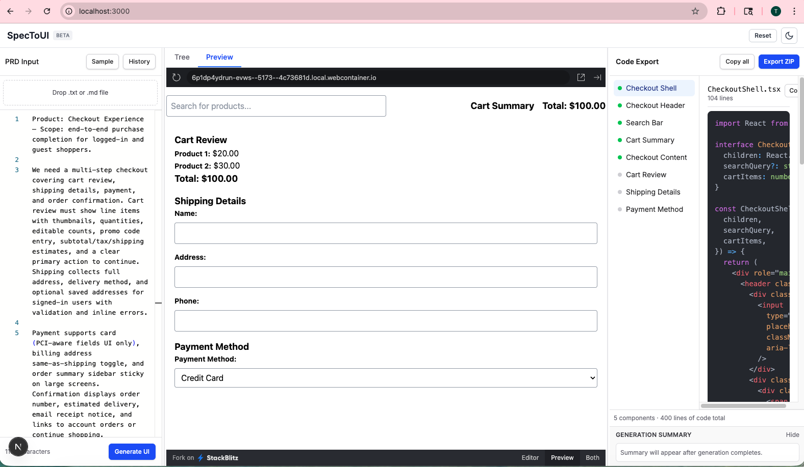

# SpecToUI Agent
### AI-Powered React Component Generator from Product Requirements Documents

> **Track:** Frontend Dev  
> **Team Name:** Team Beta  
> **Team Members:** Gokul Das M, Teenu Jose

---

## Problem Statement

When a developer receives a Product Requirements Document (PRD) from a product manager, they must manually read through it, decide which UI components are needed, plan the component hierarchy, and write all the boilerplate code. For even a medium-sized feature this process takes hours.

**SpecToUI eliminates that entirely.** Paste or upload your PRD, click Generate UI, and an AI agent pipeline reads the document, plans a complete React component tree, and streams production-ready TypeScript + Tailwind CSS code — component by component — in under a minute.

---

## Team Members & Contributions

| Name | Role | Contribution |
|---|---|---|
| Gokul Das | Software Engineer | Contributed to development of the working prototype, including Next.js UI implementation, AI agent integration, and component generation flow; participated in code structuring, feature implementation, and demo preparation |
| Teenu Jose | Senior Software Engineer | Contributed to working prototype development including AI prompt design, validation logic, and UI refinements; supported code quality and UI improvements, documentation, and demo structuring |

---

## Tech Stack with Versions

| Technology | Version | Purpose |
|---|---|---|
| Next.js | 16.2.3 | React framework with App Router |
| TypeScript | 5.9.3 | Type safety across the codebase |
| Tailwind CSS | 4.2.2 | Component styling |
| Groq SDK | 1.1.2 | AI model API client |
| Llama 3.3 70B | - | Underlying language model (via Groq) |
| Zod | 4.3.6 | Schema validation for AI outputs |
| Monaco Editor | 4.7.0 | VS Code-grade PRD input editor |
| Framer Motion | 12.38.0 | UI animations |
| React Syntax Highlighter | 16.1.1 | Code display |
| JSZip | 3.10.1 | ZIP export of generated components |
| StackBlitz SDK | 1.11.0 | Live component preview |
| next-themes | 0.4.6 | Dark/light mode |

---

## Working Prototype Screenshots

### PRD Input with Monaco Editor


### Live Generation in Progress


### Components Generated — Code Export Panel


### Generated Components Preview


---

## Demo Video

[Watch 8-minute Demo on Loom](https://www.loom.com/share/052d58fba0e54249b57f2c8cb117dfb1)

---

## How to Run Locally

### Prerequisites
- Node.js 18 or higher
- A free Groq API key — sign up at [console.groq.com](https://console.groq.com) (no credit card required)

### Step 1 — Clone the repository

```bash
git clone https://github.com/GokulDas-07/thinkpalm-agentai-spectoui-teambeta.git
cd spectoui
```

### Step 2 — Install dependencies

```bash
npm install
```

### Step 3 — Set up environment variables

Create a `.env.local` file in the project root:

```env
GROQ_API_KEY=your_groq_api_key_here
```

### Step 4 — Run the development server

```bash
npm run dev
```

Open [http://localhost:3000](http://localhost:3000) in your browser.

### Step 5 — Generate your first UI

1. Click **Sample** and select any sample PRD, or drag and drop your own `.md` or `.txt` file
2. Click **Generate UI**
3. Watch the component tree populate in real time
4. Click any component in the right panel to view its TSX code
5. Click **Export ZIP** to download all components as a ready-to-use package

---

## How It Works

```
Your PRD (plain English)
        │
        ▼
  PlannerAgent
  ├── Reads and understands the PRD
  ├── Identifies pages, features, user roles
  └── Produces a typed ComponentTree (JSON)
        │
        ▼
  GeneratorAgent
  ├── Receives the ComponentTree
  ├── Generates TSX code for each component
  └── Streams results one by one to the UI
        │
        ▼
  3-Panel UI
  ├── Left  — PRD Editor (Monaco)
  ├── Center — Component Tree View + Preview
  └── Right  — Code Export + ZIP Download
```

---

## Project Structure

```
src/
├── app/
│   ├── page.tsx                    # Main 3-panel layout
│   ├── layout.tsx                  # Root layout + theme provider
│   └── api/generate/route.ts       # Streaming SSE API route
├── lib/
│   ├── agents/
│   │   ├── AgentMemory.ts          # Session + persistent memory
│   │   ├── PlannerAgent.ts         # PRD → ComponentTree
│   │   ├── GeneratorAgent.ts       # ComponentTree → TSX code
│   │   └── AgentOrchestrator.ts    # Composes both agents
│   ├── prompts.ts                  # AI prompt functions + sample PRDs
│   └── groq-client.ts              # Groq SDK wrapper
├── hooks/
│   └── useGenerate.ts              # SSE streaming consumer hook
├── components/
│   ├── PrdEditor/                  # Left panel
│   ├── ComponentPreview/           # Center panel
│   └── CodeExport/                 # Right panel
└── types/
    └── component-tree.ts           # Zod schemas + TypeScript types

docs/
├── architecture-diagram.png        # System architecture diagram
└── architecture-writeup.md         # 1-page technical write-up

tests/
└── pipeline.test.md                # Manual test results

screenshots/
├── 01-prd-input.png
├── 02-generation-running.png
├── 03-components-generated.png
└── 04-components-preview.png
```

---

## Key Features

- Real-time streaming — watch components generate one by one via Server-Sent Events
- Recursive component tree — proper parent-child hierarchy, not a flat list
- TypeScript throughout — interfaces generated for every component's props
- Accessible code output — aria labels, semantic HTML, proper roles on every component
- Mobile-first responsive — sm: md: lg: Tailwind breakpoints on all generated code
- Sample PRDs built in — E-commerce, SaaS Dashboard, Onboarding flow
- File upload — drag and drop any .md or .txt PRD file
- Export options — copy individual components or download full ZIP
- Dark mode — full light/dark support
- PRD history — previous generations saved and reloadable

---

## Environment Variables

| Variable | Description | Required |
|---|---|---|
| `GROQ_API_KEY` | Free API key from console.groq.com | Yes |
